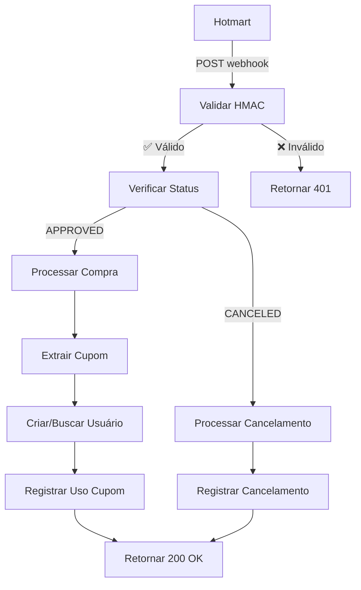

# 🔗 Integração Hotmart - CíliosClick

## 📋 Visão Geral

Esta integração permite que a Hotmart notifique automaticamente a plataforma CíliosClick sobre compras, liberando acesso aos usuários e registrando cupons de parceiros.

## 🚀 Configuração na Hotmart

### 1. Configurar Webhook

1. Acesse o **Painel Hotmart** → **Meus Produtos** → **Seu Produto**
2. Vá em **Configurações** → **Integrações** → **Webhook**
3. Configure:
   - **URL**: `https://seudominio.vercel.app/api/hotmart-webhook`
   - **Eventos**: 
     - ✅ Compra Aprovada (`PURCHASE_APPROVED`)
     - ✅ Compra Cancelada (`PURCHASE_CANCELED`)
     - ✅ Estorno (`PURCHASE_REFUNDED`)
   - **Formato**: JSON
   - **Autenticação**: HMAC-SHA256

### 2. Chave Secreta

Copie a **chave secreta** gerada pela Hotmart e configure no ambiente:

```bash
VITE_HOTMART_WEBHOOK_SECRET=sua_chave_secreta_aqui
```

## 🔧 Implementação Técnica

### Endpoint Principal

**URL**: `/api/hotmart-webhook`  
**Método**: `POST`  
**Headers**:
- `Content-Type: application/json`
- `X-Hotmart-Signature: sha256=assinatura_hmac`

### Fluxo de Processamento



### Estrutura de Dados

#### Webhook da Hotmart

```json
{
  "id": "webhook-id",
  "event": "PURCHASE_APPROVED",
  "data": {
    "purchase": {
      "order_id": "ORDER-123456",
      "order_date": 1703980800000,
      "status": "APPROVED",
      "buyer": {
        "name": "Maria Silva",
        "email": "maria@email.com"
      },
      "offer": {
        "code": "CILIOS-CLICK",
        "name": "CíliosClick - Extensão de Cílios"
      },
      "price": {
        "value": 397.00,
        "currency_code": "BRL"
      },
      "tracking": {
        "coupon": "LANA20",
        "source": "affiliate",
        "utm_source": "instagram",
        "utm_medium": "social",
        "utm_campaign": "cilios-extensao"
      },
      "affiliations": [
        {
          "affiliate": {
            "name": "Lana Rodrigues",
            "email": "lana@email.com"
          },
          "source": "LANA20",
          "coupon": "LANA20"
        }
      ]
    }
  }
}
```

#### Resposta da Plataforma

```json
{
  "success": true,
  "message": "Compra processada com sucesso",
  "data": {
    "user_created": true,
    "user_id": "uuid-do-usuario",
    "cupom_usado": "LANA20",
    "uso_cupom_id": "uuid-do-uso"
  }
}
```

## 🎯 Funcionalidades

### Liberação de Acesso

- ✅ **Usuário Novo**: Criado automaticamente no Supabase Auth
- ✅ **Usuário Existente**: Acesso mantido/atualizado
- ✅ **Email Confirmado**: Confirmação automática de email
- ✅ **Perfil Criado**: Registro na tabela `users`

### Rastreamento de Cupons

- ✅ **Extração Inteligente**: Cupom extraído de múltiplas fontes
- ✅ **Validação**: Verificar se cupom existe e está ativo
- ✅ **Registro**: Gravar uso na tabela `usos_cupons`
- ✅ **Comissão**: Calcular comissão automaticamente

### Segurança

- ✅ **HMAC-SHA256**: Validação de assinatura obrigatória
- ✅ **Headers**: Verificação de headers requeridos
- ✅ **Estrutura**: Validação de estrutura dos dados
- ✅ **Rate Limiting**: Proteção contra spam (via Vercel)

## 🧪 Testes

### Simulação de Desenvolvimento

Use a página **Admin → Teste Webhook** para testar:

1. **Compra com Cupom**:
   - Email: `cliente@teste.com`
   - Nome: `Cliente Teste`
   - Cupom: `LANA20`
   - Valor: `R$ 397,00`

2. **Compra sem Cupom**:
   - Apenas criação de usuário
   - Sem registro de cupom

3. **Cancelamento**:
   - Processa cancelamento
   - Registra no log

4. **Webhook Personalizado**:
   - Cole JSON personalizado
   - Teste cenários específicos

### Teste Manual com Postman

```bash
POST https://seudominio.vercel.app/api/hotmart-webhook
Content-Type: application/json
X-Hotmart-Signature: sha256=assinatura_hmac_calculada

{
  "id": "test-123",
  "event": "PURCHASE_APPROVED",
  "data": {
    "purchase": {
      "order_id": "TEST-ORDER-123",
      "order_date": 1703980800000,
      "status": "APPROVED",
      "buyer": {
        "name": "Teste Cliente",
        "email": "teste@email.com"
      },
      "offer": {
        "code": "CILIOS-CLICK",
        "name": "CíliosClick Test"
      },
      "price": {
        "value": 397.00,
        "currency_code": "BRL"
      },
      "tracking": {
        "coupon": "LANA20"
      }
    }
  }
}
```

## 📊 Monitoramento

### Logs da Aplicação

```javascript
// Console do navegador (desenvolvimento)
console.log('🚀 Processando webhook Hotmart:', data)
console.log('✅ Compra processada com sucesso:', resultado)
console.error('❌ Erro no processamento:', erro)
```

### Vercel Function Logs

```bash
# No dashboard do Vercel
Functions → hotmart-webhook → View Function Logs
```

### Banco de Dados

Verificar registros nas tabelas:
- `users` - Novos usuários criados
- `usos_cupons` - Cupons registrados
- `cupons` - Cupons válidos

## ⚠️ Tratamento de Erros

### Códigos de Resposta

- **200 OK**: Webhook processado com sucesso
- **400 Bad Request**: Dados inválidos ou cupom não encontrado
- **401 Unauthorized**: HMAC inválido ou ausente
- **405 Method Not Allowed**: Método diferente de POST
- **500 Internal Server Error**: Erro interno do servidor

### Retry na Hotmart

A Hotmart automaticamente reenvía webhooks com falha:
- **Tentativas**: 3x
- **Intervalo**: 5min, 30min, 2h
- **Timeout**: 30 segundos

## 🔄 Cenários de Uso

### 1. Compra Nova com Cupom
- Cliente compra usando link da parceira
- Hotmart envia webhook com cupom
- Sistema cria usuário + registra cupom
- Parceira recebe comissão

### 2. Compra Existente sem Cupom
- Cliente já cadastrado compra novamente
- Sistema identifica usuário existente
- Acesso mantido, sem cupom registrado

### 3. Cancelamento/Estorno
- Cliente cancela compra
- Hotmart envia webhook de cancelamento
- Sistema registra cancelamento
- Acesso pode ser revogado (futuro)

## 🚀 Deploy em Produção

### 1. Configurar Variáveis de Ambiente

No dashboard do Vercel:
```bash
VITE_HOTMART_WEBHOOK_SECRET=chave_secreta_da_hotmart
VITE_SUPABASE_URL=sua_url_supabase
VITE_SUPABASE_ANON_KEY=sua_chave_supabase
```

### 2. Deploy da Função

```bash
npm run build
vercel --prod
```

### 3. Configurar na Hotmart

- URL: `https://seu-dominio.vercel.app/api/hotmart-webhook`
- Ativar webhook
- Testar envio

### 4. Monitorar

- Verificar logs no Vercel
- Acompanhar banco de dados
- Validar criação de usuários

## 📋 Checklist de Integração

- [ ] Chave secreta configurada
- [ ] Endpoint deployado
- [ ] Webhook configurado na Hotmart
- [ ] Testes realizados
- [ ] Monitoramento ativo
- [ ] Documentação atualizada

## 🆘 Troubleshooting

### Webhook não está sendo recebido
1. Verificar URL configurada na Hotmart
2. Confirmar que função está deployada
3. Checar logs do Vercel

### HMAC inválido
1. Verificar chave secreta nas variáveis de ambiente
2. Confirmar formato da assinatura
3. Validar implementação HMAC-SHA256

### Usuário não criado
1. Verificar logs de erro no console
2. Confirmar configuração do Supabase
3. Checar permissões de admin do Supabase

### Cupom não registrado
1. Verificar se cupom existe na tabela `cupons`
2. Confirmar se cupom está ativo
3. Checar extração do cupom dos dados

---

**Documentação atualizada**: {{ new Date().toLocaleDateString('pt-BR') }}  
**Versão**: 1.0.0 